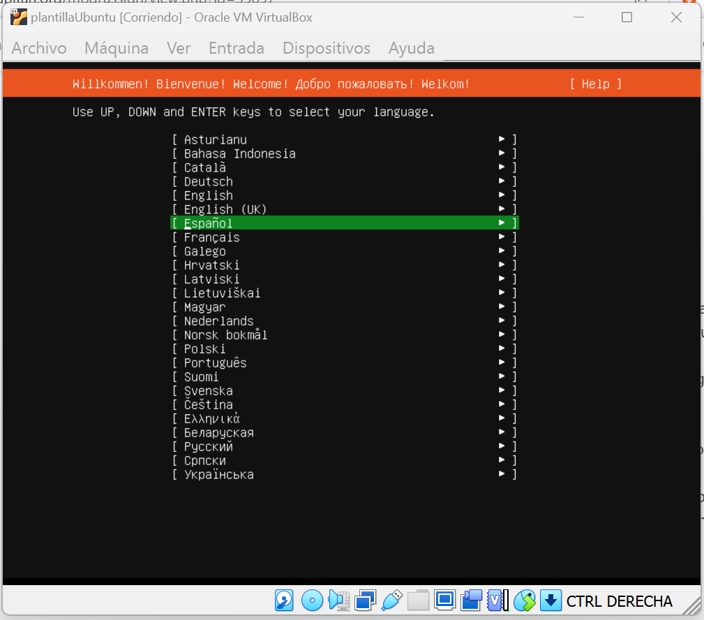
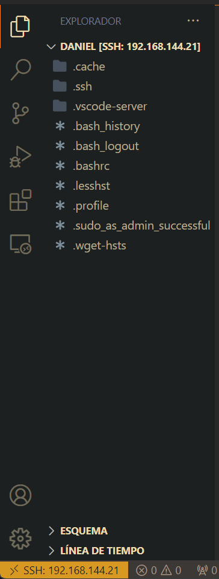

# Práctica Inicial

### Daniel Marín López

1. Actividad 1: XAMP
2. Actividad 2: VirtualBox
3. Actividad 3: Programa de Java
4. Actividad 4: Vagrant

### Actividad 1: XAMP

Para está práctica partimos de que XAMP ya está instalado y preparado para funcionar.

Con XAMP funcionando entramos en nuestro localhost y ponemos nuestro porfolio en htdocs y ya estaría listo en el servidor.

### Actividad 2: VirtualBox

Para está actividad creamos una máquina virtual con Ubuntu Server.

Una vez terminada la instalación; instalaremos apache, php, mariadb y phpmyadmin.

Una vez instalados todos los programas/servicios, instalaremos un plugin en Visual Studio Code para conectarnos mediante ssh.

Luego ejecutaremos el siguiente comando:

Lo siguiente es poner el `usuario@ipservidor`, luego nos pedirá nuestra contraseña y entraremos (hay que tener buena conexión a internet para que funcione).

Una vez cargado, al entrar en cada carpeta pedirá la contraseña.

Para poder hacer modificaciones en `/var/www/html/` hay que tener permisos especiales:

Una vez cambiados los permisos, pasamos a crear el porfolio.

La foto se puede agregar simplemente arrastrándola al directorio en el Visual Studio Code.

El resultado es el siguiente:

### Actividad 3: Programa de Java

Para esta actividad necesitaremos el programa Eclipse en su versión Enterprise.

Primero instalaremos el servidor Apache Tomcat a través de Eclipse (también se puede descargar por separado), en nuestro caso instalaremos la versión 7.0.

Luego crearemos un proyecto dinámico (único en la versión Enterprise) para desarrollar el programa en Java.

Primero creamos un archivo JSP simple, un Hola Mundo, sin embargo a veces puede que el servidor no arranque porque alguno de sus puertos está en el 8080 y este ya está ocupado (como me ocurrió). Si damos en la opción “Open” en el servidor veremos las configuraciones, mi caso era que el puerto HTTP estaba en el 8080 así que lo cambie al 8081.

Luego del cambio, el error se solucionó mostrando el Hola Mundo.

Tras la prueba, nos ponemos a trabajar en el programa. Lo primero que hacemos es crear la página principal index.jsp. En ella se le pedirá al usuario un número en un formulario y devolverá el doble.

Luego tras terminar la página principal, nos ponemos a trabajar en el programa que necesitará (llamado dobleNServlet.java).

Una vez finalizado el programa, lo probamos y vemos que funciona correctamente.

### Actividad 4: Vagrant

Esta práctica consistirá en usar el programa **Vagrant** para crear un proyecto con **Laravel/Homestead**.

Lo primero que hacemos es instalar Vagrant.

Luego ejecutamos el comando `vagrant box add laravel/homestead` para instalar el proyecto de laravel y seleccionamos la **opción de virtualbox**. En mi caso tuve que añadir `--insecure` por problemas con los certificados SSL.

Luego clonamos su repositorio con `git clone` el repositorio de laravel.

Previamente creamos el archivo **id_rsa** para **Homestead.yaml** con el comando `ssh-keygen -t rsa -C "correo@correo.es"`.

Luego iniciamos Homestead con `init.bat`.

Modificamos **Homestead.yaml** para incluir el archivo `id_rsa`.

Con el comando `vagrant up` iniciamos la máquina.

Con `vagrant ssh` nos conectamos a la máquina de Vagrant.

Y en el archivo **hosts** añadimos con la IP de **Homestead.yaml** a **homestead.test**.

Creamos el **index.html** y lo visualizamos en el navegador con **homestead.test**.

